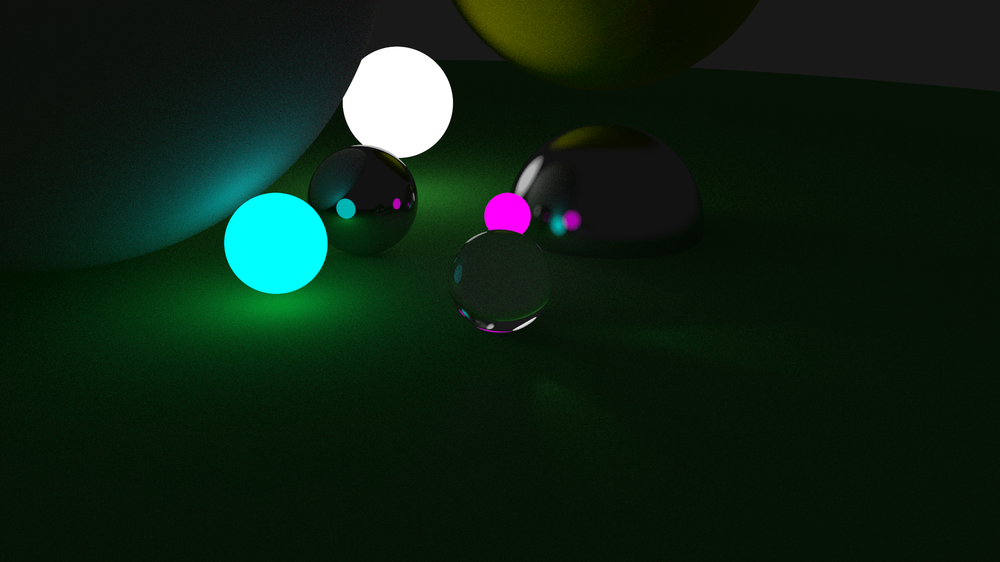

# Raytracing

This project shows my first steps into raytracing. The program just renders a simple scene and saves the rendered image to the PNG file. Also, I've chosen CUDA to achieve high performance. By now, the scene is rendered within 300 ms with 10 rays per pixel.

## Materials

Raytracer can render dielectrics (like glass or diamond), metal, and scatter materials.
